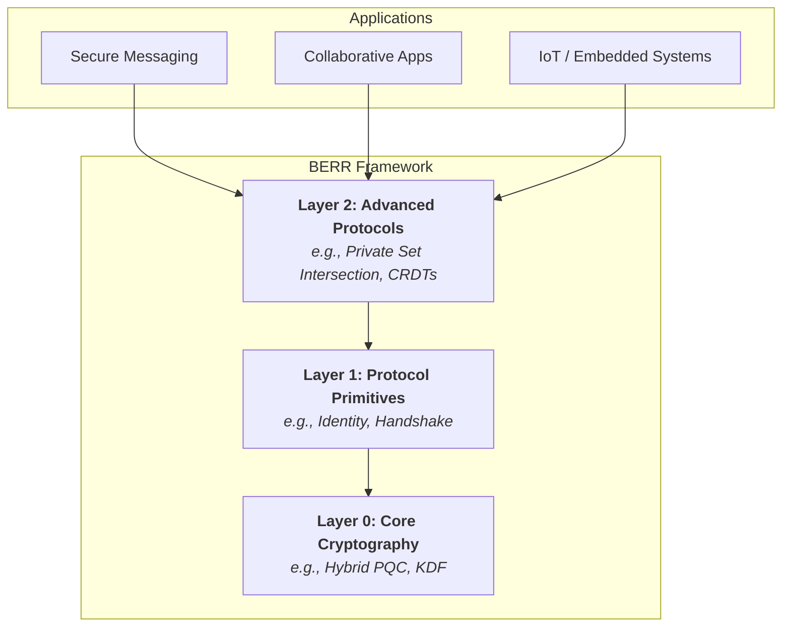

---

  <h1 style="font-weight: bold;">BERR (Beryllium)</h1>

  <strong>A composable, misuse-resistant, and post-quantum cryptography framework.</strong>

  
  
  

---

### **Project Status: Architectural Design & Public Specification**

> **Welcome to BERR.** This repository is the public home for the design, specification, and eventual implementation of the Beryllium cryptographic framework.
>
> **The source code is not yet published.** We believe that robust systems are born from transparent and rigorous design. Therefore, our initial focus is on finalizing the architecture and core specifications in the open. This document is an invitation for review, discussion, and critique from the community *before* the first lines of code are committed.

## The Vision: A New Foundation for Secure Software

The digital landscape is at a crossroads. While demand for secure and private applications has never been higher, developers are often forced to choose between using complex, low-level cryptographic tools that are easy to misuse, or relying on monolithic, application-specific protocols that lack flexibility. BERR is designed to eliminate this false choice.

Our mission is to provide a foundational layer—a true framework—that empowers developers to build a new generation of diverse, end-to-end secure systems with confidence and clarity.

## How is BERR Different? A Framework, Not Just a Protocol

Projects like the Signal Protocol have revolutionized secure messaging and proven the value of strong, end-to-end encryption. BERR stands on the shoulders of these giants but addresses a different problem at a different layer of abstraction.

In short: **If Signal is a brilliantly engineered, secure car, BERR is the next-generation factory and toolkit designed to build that car, along with secure trucks, drones, and space shuttles.**

Here’s a breakdown of what makes BERR unique:

| Feature                   | Conventional Approach (e.g., Signal Protocol)                               | BERR's Approach (A Framework)                                                                                                                                  |
| :------------------------ | :-------------------------------------------------------------------------- | :------------------------------------------------------------------------------------------------------------------------------------------------------------- |
| **1. Scope & Purpose**    | A specialized protocol masterfully designed for **asynchronous messaging**. | A general-purpose **framework** to build a wide array of secure applications: real-time collaboration, IoT, decentralized systems, and more.            |
| **2. Architecture**       | A sophisticated, highly integrated system.                                  | An explicitly **composable** system. Developers select formal handshake patterns (e.g., `IK`, `XX`) that precisely match their application's trust model. |
| **3. Post-Quantum**       | A critical **upgrade** to an existing classical protocol.                   | **Post-Quantum Native.** Hybrid cryptography (classical + PQC) is the default, fundamental nature of the framework, not an add-on.                             |
| **4. Core Vision**        | Primarily focused on **secure transport** of data.                          | Extends beyond transport to include **secure state synchronization** (CRDTs) and **privacy-preserving proofs** (e.g., Private Set Intersection).        |

## Core Principles: The BERR Doctrine

Our design is governed by a strict set of principles. Each one addresses a known failure mode in applied cryptography.

#### 🔒 **Misuse-Resistance by Design**
*   **The Problem:** Most cryptographic libraries provide powerful but sharp tools. A developer can easily misuse them, for example, by reusing a nonce or forgetting to check a MAC tag.
*   **BERR's Solution:** The API surface is intentionally restrictive. Nonce management is automated. Key types are strongly enforced. There is no API path to perform unauthenticated encryption.

#### 🧩 **Transcript-Based Protocol Integrity**
*   **The Problem:** In complex protocols, an attacker can sometimes take a valid message from one context and "replay" it in another, confusing the state machine.
*   **BERR's Solution:** We use a transcript-based architecture. Every significant event is cryptographically hashed into a running state. Each new key is derived from the *entire history* of the conversation, binding every action to its exact context.

#### 🛡️ **Aggressive Domain Separation**
*   **The Problem:** Using the same key for multiple purposes (e.g., encryption and signing) can lead to catastrophic cross-protocol attacks.
*   **BERR's Solution:** A key's purpose is baked into its derivation. We derive keys from a master secret with a unique, human-readable string (e.g., `"berr-v1-channel-encryption"`), making accidental reuse impossible.

## Architectural Blueprint

## Development Roadmap & Current Focus

Our development is transparent and phased.

**Current Focus:** Finalizing the detailed cryptographic specifications for `berr::core` and the `berr::protocol::handshake` module.

-   [ ] **Phase 1: Specification & RFC (In Progress)**
    -   [ ] Publish detailed design documents for all layers.
    -   [ ] Community review and feedback period.
    -   [ ] Finalize the public API and cryptographic constructions.
-   [ ] **Phase 2: Core Implementation (`berr::core`)**
    -   [ ] **Source code publication begins.**
    -   [ ] Implement the foundational hybrid cryptographic primitives.
-   [ ] **Phase 3: Protocol Layer & Examples**
    -   [ ] Implement the `Handshake` and `Identity` primitives.
    -   [ ] Provide reference examples demonstrating the framework's capabilities.
-   [ ] **Phase 4: Advanced Features & Audits**
    -   [ ] Implement Layer 2 protocols.
    -   [ ] Prepare for and undergo third-party security audits.

## How to Get Involved

This is a community-driven effort in its most crucial stage.
*   **Watch this repository** to be notified of updates and the publication of source code.
*   **Join the Conversation in Issues:** The [Issues](https://github.com/oqullcan/BERR/issues) tab is the primary venue for all public discussion. Feel free to open an issue to ask questions, challenge our design assumptions, or propose new ideas.
*   **Review the Specifications:** Once published, our design documents will be the primary focus for community feedback.

## License

The BERR framework will be dual-licensed under the terms of both the **MIT License** and the **Apache License 2.0**, granting maximum flexibility to developers and contributors.
